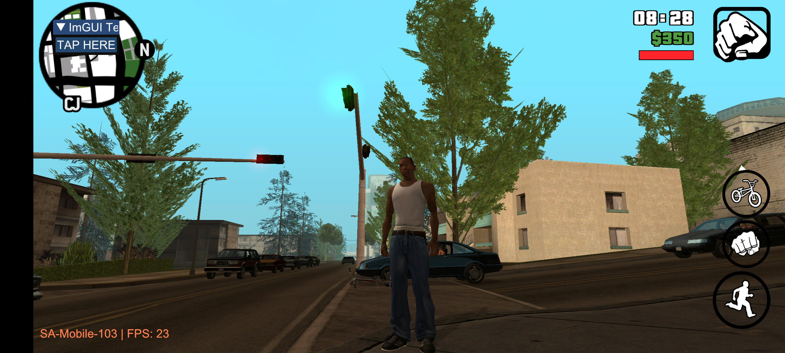
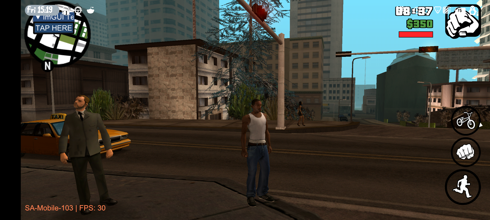

# SAMobile
An experimental MTA and SAMP implementation for GTA SA v210 on AArch64

## Project aims
- Complete replacement for build69 (SAMP for ARMv7 from GTASA v1.8 what has deprecated)

## Screenshots (work-in-progress), thorough testing, and additional fixes are still needed




> Most notable things: 1. ImGUI is almost working properly as expected - 2. We can draw things on the surface

## How to compile?
- Before start make sure that you have configured the `env.json` file in the project folder

## Limitations of hook system
- Can't to replace or emplace instructions that are a 'ret' or any type of branch
- Can't to replace or save any instruction that changes or modifies the x8 or x30 registers (only the function prologue is allowed)

## Todo
```

- [] Handle vehicle and NPC pools
- [] Get/Set player coordinates (*)
- [] Create single and multiplayer player objects
- [] Handle life and AFK
- [] Create SAMP splash screen
- [] Better handle entries systems
- [] Update internal libraries and fix the code base inconsistency (*)
- [] Implement .txd/.dff dynamic loader (uncompress .txt for each GPU platform if needed)
- [x] Add libRakNet to the vendor directory
```
